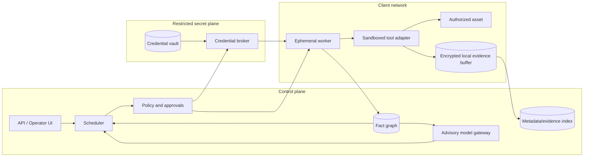

# Reference System Design

## Trust boundaries



### Boundary rules

- The control plane stores credential references, never raw secrets.
- The model gateway receives redacted, task-minimal graph projections—not evidence dumps.
- Workers accept only signed, scoped jobs and obtain secrets just in time.
- Tool adapters cannot contact targets outside the job allowlist.
- Evidence crosses the client boundary only under the agreed data-residency policy.
- Policy and approval decisions are deterministic and cannot be overridden by a model recommendation.

## Core services

### Engagement and scope service

Stores signed scope versions, inclusions/exclusions, source workers, windows, client contacts, and test-mode configuration. Every job binds to an immutable scope version.

### Fact/attack graph

Stores observations and derived relationships with provenance and expiry. Use stable identity keys such as SID/GUID plus domain context; do not merge only by display name or IP.

### Module registry

Holds signed module manifests, versions, input/output schemas, impact classification, safety limits, artifact contracts, and lab-validation status.

### Planner

Matches graph facts to module preconditions and objectives. It may use graph queries, deterministic rules, scoring, and an advisory model. Its output is a candidate action—not execution authority.

### Policy/approval service

Produces `allow`, `deny`, or `approval required` with reason codes. It maintains global budgets across workers and invalidates stale approvals when targets, credentials, scope, or time change.

### Worker manager

Leases short-lived workers, verifies posture/version, dispatches signed jobs, enforces egress, and supports immediate revocation.

### Credential broker

Authorizes one secret use for one module/target/window. It returns the secret directly to a protected worker channel and emits only audit metadata.

### Evidence service

Stores structured results, redacted raw evidence, action logs, approvals, and artifacts. Use encryption, per-engagement keys, role-based access, immutability for audit records, and automatic retention/deletion.

### Reporting service

Builds findings from verified facts and evidence, tracks remediation, and produces machine-readable and human views. It cannot mark a high-impact finding confirmed without required evidence/reviewer state.

## Minimum job states

```text
DRAFT → ELIGIBLE → POLICY_CHECKED → AWAITING_APPROVAL → QUEUED
      → RUNNING → NORMALIZING → VERIFIED → COMPLETE

Any state → DENIED | CANCELLED | TIMED_OUT | FAILED | CLEANUP_REQUIRED
CLEANUP_REQUIRED → CLEANUP_RUNNING → CLEANED | RESIDUAL_ARTIFACT
```

Authentication-sensitive or state-changing jobs never auto-retry from `FAILED` or `TIMED_OUT`.

## Suggested action record

```json
{
  "action_id": "ACT-000123",
  "engagement_id": "ENG-2026-001",
  "scope_version": "sha256:…",
  "module": {"id": "module.id", "version": "1.2.3"},
  "source": {"worker_id": "WRK-02", "identity_ref": "CRED-004"},
  "targets": [{"entity_id": "HOST-019", "scope_status": "included"}],
  "reason": {"objective": "HVT-01", "prerequisite_fact_ids": ["FACT-11"]},
  "impact": {"rating": "medium", "state_change": false},
  "limits": {"timeout_seconds": 300, "concurrency": 1},
  "policy": {"decision": "allow", "policy_version": "sha256:…"},
  "approval_ref": null,
  "status": "queued",
  "artifact_ids": [],
  "evidence_ids": []
}
```

No secret values belong in this record.

## Approval tiers

| Tier | Examples | Approval |
|---|---|---|
| 0 | Passive/client-provided data processing | Preapproved policy |
| 1 | Rate-limited discovery and authenticated read-only queries | Preapproved policy |
| 2 | Bounded authentication, ticket requests, metadata collection across hosts | Operator confirmation or engagement-specific approval |
| 3 | Poison/relay/coerce, endpoint execution, credential stores, object/certificate creation | Named senior operator + client gate |
| 4 | DCSync, actual forged tickets, trust/hybrid control validation, sensitive data | Two-person approval, named client authority, maintenance window |
| 5 | Destructive/persistent/availability testing | Outside ordinary workflow; separate exercise |

## Security controls

- mutual TLS and per-worker identity;
- signed jobs and modules/images;
- secretless control-plane records;
- outbound allowlists and target-aware network policy;
- immutable audit trail for scope, approval, secret use, actions, and cleanup;
- sandbox/least privilege per tool adapter;
- content and size limits for evidence;
- DLP/secret redaction before model or report layers;
- model prompt/output logging without sensitive values;
- tested kill switch and worker quarantine;
- SBOM, vulnerability scanning, version pinning, and supply-chain review;
- tenant isolation and per-engagement encryption keys;
- disaster recovery that does not restore expired customer evidence.

## Validation strategy

Build a lab matrix covering supported domain/forest functional levels, Windows releases, SMB/LDAP/Kerberos configurations, AD CS patterns, trusts, segmentation, common defenses, success/failure/timeout cases, and cleanup.

Each module needs tests for:

- correct precondition match and non-match;
- excluded target and expired approval denial;
- rate/authentication budget enforcement;
- expected success and expected defense block;
- parser behavior under localization/version/partial output;
- secret redaction;
- crash/timeout/retry behavior;
- artifact creation and independent cleanup verification;
- graph update and invalidation of stale facts.
