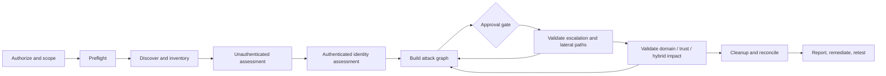

# 4. Testing Methodology

## End-to-end flow

Each action produces facts and evidence. New facts can make a previously impossible test eligible—for example, discovering a machine-account creation path can enable an AD CS scenario. The scheduler may revisit parked paths, but must not cross an approval or scope boundary automatically.

## Phase 0 — authorization and threat hypotheses

Define starting personas and business-relevant objectives. Examples:

- unauthenticated user on a corporate office segment;
- compromised ordinary employee account and workstation;
- compromised server service account;
- third-party support identity;
- attacker controlling a child domain in a trusted forest;
- on-premises identity attempting to reach the Entra control plane.

For each persona, state what “impact” means: access to tier-zero identities, backup systems, production administration, sensitive applications, another forest, or cloud roles. This keeps testing focused on paths rather than a checklist of attack names.

## Phase 1 — preflight and baseline

- Verify scope enforcement, source address, DNS, time, routing, and contacts.
- Capture a timestamped worker/tool/configuration manifest.
- Confirm test identities and privileges without recording secret values.
- Establish request/concurrency/authentication limits.
- Ask the client to confirm backup and replication health for state-changing work.
- If this is collaborative, record the relevant baseline in EDR, SIEM, domain-controller, AD CS, and network logs.

Output: signed go/no-go record and immutable configuration snapshot.

## Phase 2 — discovery and service inventory

Begin with low-impact sources, then deepen selectively:

1. approved scope ranges and client inventory;
2. DNS domain/SRV records and reverse resolution;
3. live-host and targeted service checks;
4. identification of domain controllers, Global Catalog, DNS, Kerberos, LDAP/LDAPS, SMB/RPC, WinRM, RDP, SSH, databases, web applications, and AD CS surfaces;
5. OS/service characterization only to the resolution needed for a test decision;
6. topology and trust candidates.

Normalize results into stable entities instead of passing raw scanner text between tools. Preserve provenance: the same host observed by DNS, SMB, and LDAP is one entity with three observations.

Output: asset/service inventory, confidence, source, first/last seen, and scope status.

## Phase 3 — unauthenticated AD and infrastructure checks

Evaluate only permitted techniques, such as:

- anonymous/null access to SMB, LDAP, RPC, and exposed shares;
- discoverable users, groups, computers, domains, and password-policy metadata;
- SMB signing and dialect posture;
- LDAP signing/channel binding and LDAPS posture;
- name-resolution protocols and relay prerequisites;
- exposed management interfaces and legacy/insecure services;
- AD CS web endpoints and publicly observable configuration;
- unauthenticated application or appliance paths that yield an AD identity.

Password guessing is not passive discovery. It remains behind the spray gate even if user names are publicly discoverable.

Output: initial-access hypotheses, verified anonymous exposure, and facts for later modules.

## Phase 4 — authenticated directory and relationship collection

Using a dedicated standard identity:

- enumerate domains, forests, trusts, sites, OUs, users, groups, computers, sessions, SPNs, delegation, ACLs, Group Policy links, and certificate services within approved collection methods;
- enumerate reachable shares by metadata and ACL before reading content;
- collect local-administrator and session relationships only on approved systems;
- identify stale, privileged, service, and delegation-sensitive identities;
- calculate attack paths to designated high-value targets;
- compare observed inventory to client-provided inventory.

BloodHound-style collection belongs here, but the graph is a decision aid—not proof. Every material edge used in a finding must be validated against its source observation and current state.

Output: versioned identity/relationship graph and candidate paths.

## Phase 5 — controlled initial access and credential validation

Run only the approved options:

- lockout-aware password spray using organization-specific or test-only candidates;
- AS-REP roast or Kerberoast collection with offline strength analysis;
- exposed secrets in permitted configuration files, scripts, shares, deployment artifacts, or descriptions;
- authentication relay/coercion in a bounded target set;
- certificate enrollment misconfiguration validation;
- default/weak credential checks on explicitly approved services.

Any discovered secret is an evidence object with classification, source, access controls, and retention—not text to paste across tools. Before reuse, confirm the target/service is in scope and the RoE permits credential replay.

Output: verified credential or access facts, blocked attempts, and detection telemetry.

## Phase 6 — post-access testing

When a controlled shell, SMB administrative access, RDP/WinRM session, SSH session, or other foothold is obtained:

1. **Reconfirm context:** hostname, identity, integrity level, network segment, time, EDR state, and scope.
2. **Inventory privilege without changing state:** group memberships, token privileges, local rights, accessible management surfaces, scheduled/service configuration, and credential-protection posture.
3. **Horizontal movement analysis:** other resources reachable with the same privilege—shares, local-admin reuse, active sessions, remote-management rights, service identities, and delegation relationships.
4. **Vertical escalation analysis:** paths from the current identity to local administrator, a more privileged domain identity, tier zero, another trust, or the hybrid control plane.
5. **Choose the least invasive proof:** validate ACL/configuration first, use a named canary or test host next, and request approval for credential material or code execution.
6. **Record and clean:** capture structured evidence, remove any temporary artifacts, and update the graph.

Do not automatically dump SAM/LSA/LSASS, deploy an agent, or reuse every discovered credential merely because a shell exists. Those actions are separate approval gates.

## Horizontal versus vertical testing

**Horizontal privilege expansion** asks what the current identity can access at roughly the same privilege level: another endpoint through local-admin reuse, another user's share, a peer application, an active session, or a service using the same credential.

**Vertical privilege escalation** asks how to obtain greater authority: local admin, server admin, delegated directory control, certificate-based privilege, Domain Admin-equivalent control, directory replication rights, forest trust control, or a cloud administrative role.

A path can alternate between both. For example:

`ordinary user → writable deployment share → code executes as service account → local admin on management server → session/credential relationship → delegated directory control`

Report the entire verified chain and the control that most efficiently breaks it.

## Phase 7 — domain, forest, and hybrid impact

These are impact-validation steps, not routine enumeration:

- directory replication/DCSync permission and controlled execution;
- KRBTGT/domain-signing-key exposure and Golden Ticket feasibility;
- service-account key exposure and Silver Ticket feasibility;
- constrained/unconstrained delegation or resource-based constrained delegation abuse paths;
- AD CS enrollment/issuance paths that yield privileged authentication;
- child/parent domain and forest-trust paths;
- Entra Connect, federation, SSO, and synchronization-account paths;
- access to backup, virtualization, endpoint-management, or identity-security infrastructure.

Prefer simulation or configuration-backed proof. If an actual forged ticket or replication request is authorized, bind it to a named test account/service, minimum lifetime/data, auditable source, and immediate purge/cleanup verification.

## Phase 8 — cleanup and reconciliation

- Stop active jobs before cleanup.
- Reconcile every created/modified object against the artifact register.
- Purge test tickets, certificate/private-key material, cached secrets, worker containers, and temporary data as agreed.
- Revoke/expire test identities, API tokens, and certificates.
- Verify—not merely attempt—removal of accounts, machine objects, services, scheduled tasks, binaries, registry changes, files, and policy changes.
- Give the client a residual-artifact list for anything that could not be independently verified.
- Archive only the minimum evidence required by the retention policy.

## Phase 9 — reporting and retest

Report confirmed paths, blocked paths, coverage limits, operational effects, and defensive detections. Prioritize fixes using path reduction: a control that removes ten routes to tier zero is usually more valuable than ten isolated low-risk hygiene changes.

For retest, run the minimum checks needed to validate the fix and search for alternate paths created or exposed by the change. Do not silently rerun the entire assessment unless it is reauthorized.
