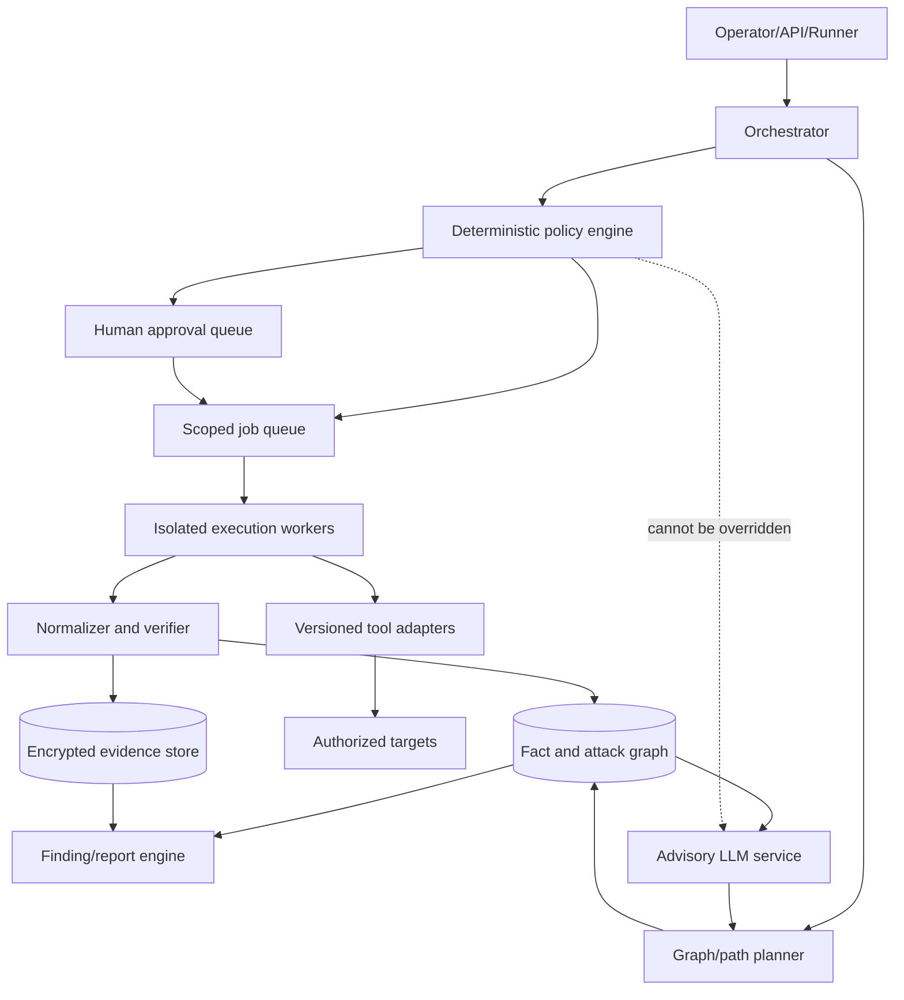

# 8. Automation Architecture and Human-in-the-Loop Design

## Core design principle

Automate the repeatable mechanics; retain human accountability for material risk.

The system should behave like a policy-constrained, event-driven workflow rather than a chatbot with a shell. Discovery modules add typed facts to a graph. The planner finds tests whose prerequisites are satisfied. A deterministic policy engine checks scope, safety, and approvals. Workers run narrow tool adapters. Results are normalized, evidenced, and returned to the graph. New facts can activate new paths.



## Fact graph

Use typed, immutable observations and derived facts. Suggested entity types:

- scope object, network, host, service, domain, forest, site, tenant;
- user, group, computer, managed/service identity, role;
- credential reference, hash reference, ticket reference, certificate reference;
- share, file metadata, application, database;
- certificate authority/template;
- trust, session, local-admin relationship, ACL relationship, delegation relationship;
- weakness, control, high-value target, finding;
- action, approval, evidence object, artifact, cleanup verification.

Suggested relationship examples:

- `HOSTS_SERVICE`, `RESOLVES_TO`, `MEMBER_OF`, `ADMIN_TO`, `HAS_SESSION`;
- `CAN_READ`, `CAN_WRITE`, `CAN_ENROLL`, `CAN_DELEGATE`, `CAN_REPLICATE`;
- `AUTHENTICATES_TO`, `TRUSTS`, `SYNCS_TO`, `OBSERVED_BY`;
- `REQUIRES`, `ENABLES`, `BLOCKED_BY`, `PROVES`, `CREATED_ARTIFACT`.

Every observation needs provenance, timestamp, confidence, scope status, sensitivity, and expiry. Derived facts must link to their inputs so a stale or disproven observation invalidates dependent paths.

## Module contract

Each module should declare, before it can run:

```yaml
id: ad.example.read_only_check
version: 1.0.0
purpose: "Evaluate one narrowly defined hypothesis"
preconditions:
  - typed facts required from the graph
inputs:
  - typed target and credential references
scope_effect: "targets consulted or discovered"
impact:
  network: low
  authentication: none
  endpoint: none
  directory_change: false
approval: allowed
limits:
  timeout_seconds: 300
  max_targets: 50
  max_concurrency: 5
artifacts: []
cleanup: null
outputs:
  - normalized fact schema
evidence:
  - minimum fields and redaction rules
```

High-impact modules additionally declare the exact state change, credential/data classes touched, expected telemetry, rollback, independent cleanup check, and whether two-person approval is required.

## Eligibility loop

The following pseudocode is deliberately non-executable and tool-agnostic:

```text
on new_verified_fact(fact):
    update_graph(fact)
    invalidate_stale_derivations()
    candidates = modules_with_satisfied_preconditions(graph)

    for candidate in prioritize(candidates, objectives, risk, coverage):
        decision = deterministic_policy(candidate, scope, limits, approvals)
        if decision == DENY:
            record_block(candidate)
        elif decision == REQUIRE_APPROVAL:
            present_human_readable_action(candidate)
        elif decision == ALLOW:
            enqueue_idempotently(candidate)

on module_result(result):
    verify_and_normalize(result)
    store_minimal_evidence(result)
    register_artifacts_and_cleanup(result)
    emit_new_verified_facts(result)
```

This design explains how automation can “park” a path and reactivate it when a missing prerequisite appears. The exact NodeZero scheduler is proprietary; applying this model to NodeZero is an architectural inference based on public attack graphs, action logs, module metadata, and demonstrations.

## Deterministic policy engine

The policy engine—not the LLM—must enforce:

- target inclusion/exclusion and newly discovered boundary handling;
- approved source workers and time windows;
- permitted technique state;
- credential/account restrictions;
- authentication, query, bandwidth, and concurrency budgets;
- data-content and sample-size limits;
- artifact naming/expiry requirements;
- human/two-person approvals;
- kill switch and automatic stop conditions;
- evidence redaction and retention;
- cleanup completion before dependent work or closeout.

Policy decisions should be signed/auditable and use deny-by-default semantics.

## Credential broker

Workers should receive opaque credential references, not secrets from the graph or LLM context. The broker:

- validates target, protocol, module, approval, and time window;
- releases a secret only to the named isolated job;
- redacts process output and telemetry;
- records use without recording the value;
- supports expiry/revocation and cleanup;
- prevents an obtained credential from being replayed across every reachable service automatically.

Horizon3's public `h3-cli` guide describes an automated credential-injection pattern in which a local secret is encrypted and a Runner retrieves/injects it for scheduled tests while Horizon3 retains the associated key rather than the local secret. That is one implementation pattern; an internal system may use a conventional enterprise vault instead.

## Scheduler and prioritization

Useful prioritization signals:

- distance to an approved high-value target;
- confidence and freshness of prerequisite facts;
- expected information gain;
- likelihood of breaking/confirming multiple paths;
- operational impact and detection objectives;
- remaining budgets and maintenance window;
- analyst-entered hypotheses;
- redundant coverage already obtained.

Risk-adjusted priority should never convert a prohibited action into an eligible one. Concurrency applies only to independent, low-risk jobs; serialize authentication-sensitive and state-changing actions.

## Result normalization and verification

Tool output is untrusted input. The normalizer must:

- capture tool/module/image version and source worker;
- recognize partial success, timeouts, stale cache, and access-denied outcomes;
- map hostnames/SIDs/GUIDs/IPs without destructive merging;
- remove/replace secret values before broader storage;
- correlate duplicate observations;
- apply confidence and expiry;
- require a second signal for consequential edges where practical;
- retain a minimal raw-evidence pointer for analyst verification.

Do not let an LLM be the sole parser for authorization or success. It may help triage unstructured output, but deterministic schemas/tests decide whether a fact enters the authoritative graph.

## Human approval request

An actionable approval screen should show:

- proposed action in plain language;
- source identity/worker and exact target(s);
- why it is now eligible and which path/objective it advances;
- credentials/data touched;
- expected Windows/network/EDR artifacts;
- risk and blast radius;
- limits, timeout, and kill switch;
- planned cleanup and validation;
- safer alternative or simulation option;
- approval expiry and named approver(s).

Approval is specific to that action/target/window. It is not a permanent toggle for the technique.

## What to automate

Good automation candidates:

- scope normalization and preflight checks;
- host/service/domain/controller discovery under fixed limits;
- authenticated, read-only directory collection;
- fact correlation, graph updates, freshness, and path queries;
- eligibility/precondition evaluation;
- tool invocation through narrow adapters;
- evidence capture/redaction and report scaffolding;
- artifact registration and cleanup verification;
- regression/retest of a fixed finding;
- defensive event correlation.

## What should remain human-led

- authorization, scope ambiguity, third-party ownership;
- high-impact approvals and incident calls;
- interpreting unusual business systems and identity semantics;
- deciding whether added impact evidence is necessary;
- customer-data sampling;
- novel chains not covered by tested modules;
- attempts to bypass or evade client defenses;
- finding validation, severity, remediation tradeoffs, and executive communication;
- accepting incomplete cleanup or residual risk.

## AI's proper role

Use AI for advisory tasks:

- summarize the relevant subgraph and explain candidate paths;
- map observations to hypotheses and ATT&CK-style categories;
- rank duplicate findings for analyst review;
- suggest safer validation options;
- turn structured evidence into draft narratives/remediation;
- identify missing context or contradictory observations;
- help query documentation and prior authorized outcomes.

Do not permit AI alone to:

- expand scope;
- generate or select password candidates against real users;
- change authentication/rate budgets;
- retrieve or expose secrets;
- approve high-impact actions;
- run arbitrary shell commands;
- decide that cleanup succeeded;
- publish findings without analyst review.

## Failure and recovery design

- Jobs are idempotent or carry a unique action key.
- A worker crash cannot strand an untracked state change.
- Queue retries obey budgets and never retry authentication/state changes blindly.
- Every state-changing action schedules a cleanup check independent of job success.
- Graph and evidence writes are transactional enough to preserve provenance.
- A global kill switch blocks dispatch and revokes worker leases.
- Offline workers fail closed when policy/approval freshness cannot be verified.
- Operators can export an artifact/cleanup register even if reporting is unavailable.
